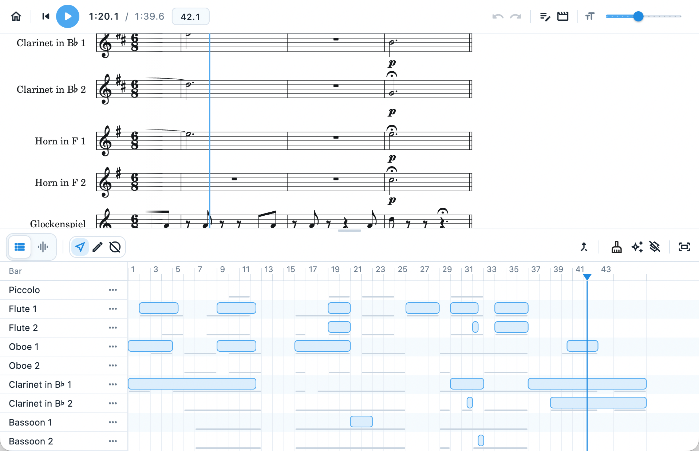
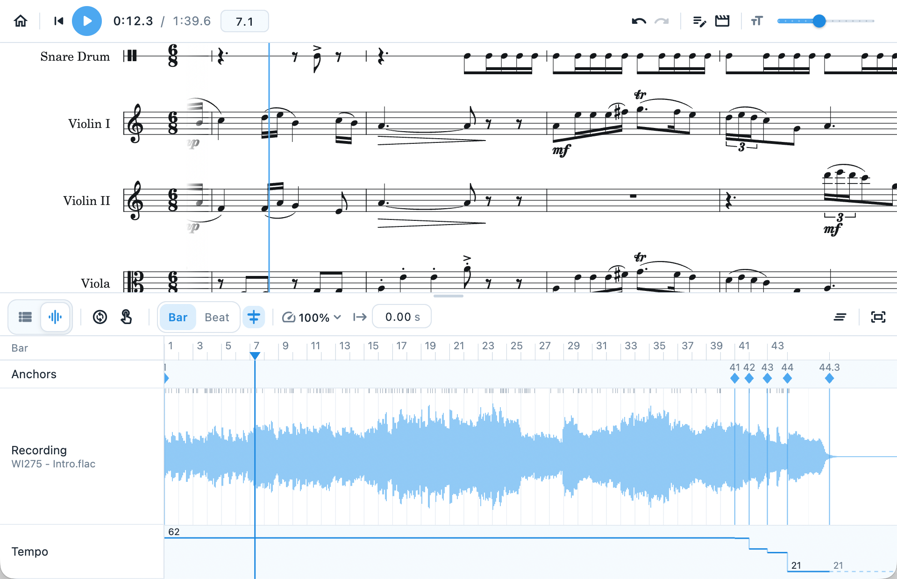
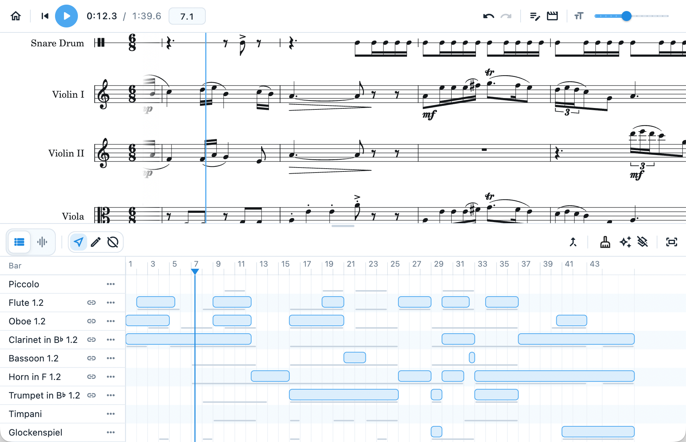

# Curator

The next generation of condensed scores.

This project is inspired by The Beethoven 9 App on iOS.

Learn more at https://0x57.cc/xylabs-introducing-curator/

Still in heavy development, but most functions should work.

See the final demo!

https://www.youtube.com/watch?v=BVE01OheT70

We even support condensing!

> [!warning]
>
> Only macOS is tested.

## Screenshots

